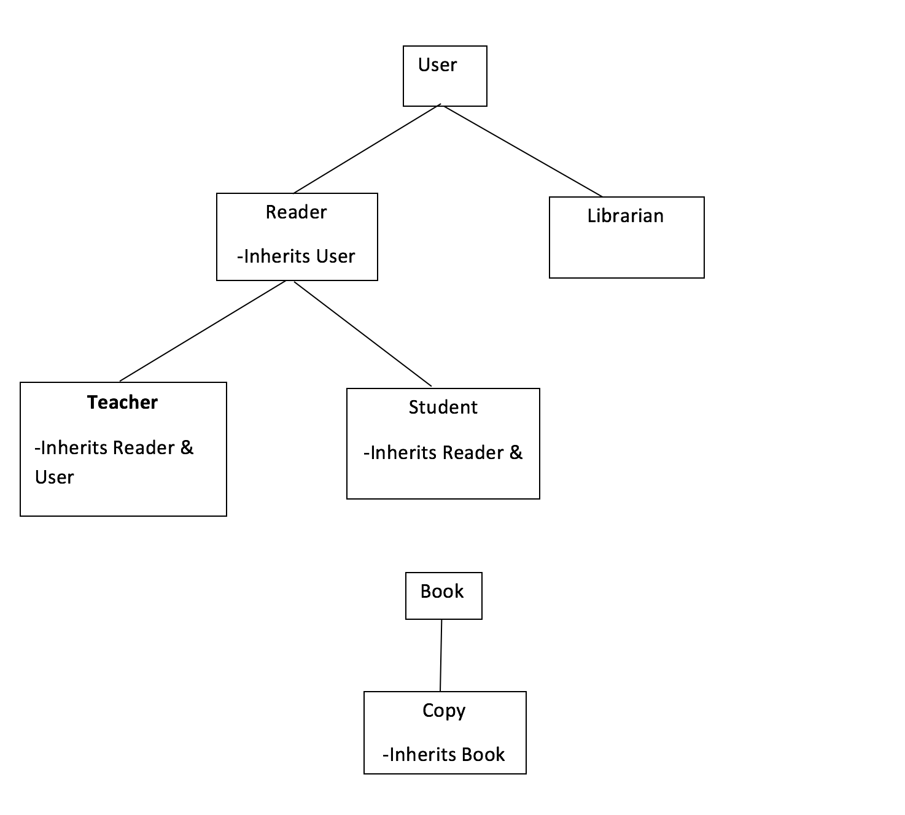

# Library_System
A library system programmed in C++ to perform most functions of a real library, such as user login, book checkout, book reservation, etc. 

**Library Management System**

For this project, I constructed a library system with most of the functions of a real library. To implement it, I had to create a few different classes in order to make it easier to create and delete objects such as books, copies, readers, librarians, etc.

Shown below is the architecture used for the classes. A class that branches means that it served as a parent class for the derived class below.

Using the hierarchy above, I created the classes in separate files including User.h, User.cpp, Reader.h, Reader.cpp, Student.h, Student.cpp, Teacher.h, Teacher.cpp, Librarian.h, Librarian.cpp, Book.h, Book.cpp, and Copy.h and Copy.cpp. The header files for each class contained the declaration statements for things such as the constructors, mutators, accessors, overloaded operators, different functions (such as print) and that classes private data members. The implementation files (.cpp) contained the definitions for the respective classes constructors, accessors, mutators, etc. By keeping the class definition and implementation in separate files, this allowed me to have a concise and simple workflow which prevented the creation of unnecessarily long files.

In the following pages I will go through each of the classes and describe the member variables and functions I implemented.

**Book Class**

Member variables:

- Int – ISBN, - ISBN of the book, a unique identifier
- string title; -- title of the book
- string author; -- author of the book
- string category; -- category of the book
- int numreservers; -- number of reservers of the book

Member functions:

- Constructors
  - Book(); -- default constructor
  - Book(int ISBN, string temptitle, string tempauthor, string tempcategory); -- constructs book object given its title, author, category, and ISBN
- Mutators and accessors
  - void settitle(string); -- set title of the book
  - void setauthor(string); -- set author of the book
  - void setcategory(string); -- set category of the book
  - void setISBN(int); -- set ISBN of the book
  - int getISBN(); -- return ISBN of the book
  - int getnumreservers(); -- return the number of reservers of book
  - deque\&lt;string\&gt; getlistofreservers(); -- return queue of reservers
  - string getauthor(); -- return author of book
  - string gettitle(); -- return title of the book
  - string getcategory(); -- return category of the book
  - void addreserver(string); -- add reserver to book based on username
  - void setnumreservers(int); -- set number of reservers of the book
  - void setlistofreservers(deque\&lt;string\&gt;); -- set queue of reservers of book
  - void deletereserver(string); -- delete user from reserver list
- Operator overloading
  - bool operator== (const Book); -- check if two books are equivalent by comparing their ISBNs
  - void operator\&gt;\&gt; (list\&lt;Book\&gt;&amp;); -- input books from file stream
  - void operator\&lt;\&lt; (list\&lt;Book\&gt;&amp;); -- outputbooks to file stream
  - bool operator\&gt;( const Book&amp; rhs) const; -- check if book is greater than other by comparing list of reservers. (used to sort books found while searching by popularity)
- Functions
  - Void printbook(); -- print book information
  - Void printreservers(); -- print the list of reservers of the book
  - Static void printbooks(list\&lt;Book\&gt;&amp; mybooks); -- print list of books
  - Void updatequeue(int&amp; currentdate, int&amp; reservationdate); -- update reservation queue by checking when reservations were made and comparing it to current date
  - Void deletefirstinline(); -- delete first reserver of the book from the queue
  - Static Book whichbook(int, list\&lt;Book\&gt;); -- intake an ISBN and find that book in the list of books and return it

**Copy Class**

Member variables:

- String – readername, name of current reader of the copy
- Int – ID, ID of the copy of the book
- Int – borrowdate, date that the book was borrowed on
- Int – reservationdate, date that the book was returned and is available to the first reserver
- Int -- expirationdate, date that the copy is due back by

Member functions:

- Constructors
  - Copy(); -- default constructor of copy
  - Copy(Book); -- create a copy of a book based on the book parameters. Automatically generates a new id for the copy
- Accessors and mutators
  - void setreadername(string); -- set readername of the copy
  - string getreadername(); -- return readername of the copy
  - void setborrowdate(int); -- set borrowdate of the copy
  - void setreservationdate(int); -- set reservation date of copy
  - int getreservationdate(); -- return reservation date of copy
  - void setexpirationdate(int); -- set expiration date of copy
  - int getexpirationdate(); -- return expirationdate of copy
  - void setID(int); -- set ID of copy
  - int getID(); -- return ID of copy
- Operator overloading
  - void operator\&gt;\&gt; (list\&lt;Copy\&gt;&amp; mycopies); -- input copy list from input file
  - void operator\&lt;\&lt; (list\&lt;Copy\&gt;&amp; mycopies); -- output copy list to output file
  - void operator==(Const Copy&amp;); -- used to see if two copies are equivalent by comparing ID
- Functions
  - Void printCopy(); -- print copy&#39;s information
  - Static void printcopies(list\&lt;Copy\&gt;&amp; mycopies); -- prints information for all copies in list
  - Void copyreturned(int currentdate); -- update a copy&#39;s information when returned

**User Class**

Member variables:

- string – username
- string – password

Functions:

- constructors
  - User( ); -- Default
  - User(string newuser, string newpassword) – parameterized constructor. Accepts strings for the username and password.
- Accessors and mutators
  - string get\_username() – returns username of user
  - string get\_password() – returns password of user
  - string set\_username() – sets username for user
  - string set\_password() – sets password for user
- functions
  - void print\_user() – prints user info (username and password)

**Reader Class**

Member variables:

- char – readertype, this tells us if a reader is a student &#39;s&#39; or teacher &#39;t&#39;
- int – numbooksreserved, # of books reserved by reader
- int – numcopiesborrowed, # of copies checked out by reader
- int – max\_copies, max # of copies allowed out at once by reader (2 for student, 5 for teacher)
- list\&lt;Copy\&gt; copiesborrowed, a list of the copies checked out by the reader
- list\&lt;Book\&gt; booksreserved, a list of the books reserved by the reader
- int – numpenalties, # of penalties acquired by reader

Functions:

- Constructors
  - Reader() – default
  - Reader(string username, string password) – parameterized constructor
  - Reader(char readertype, string username, string password, int numcopies, list\&lt;Copy\&gt; copiesborrowed, int numbooks,list\&lt;Book\&gt; booksreserved, int numpenalties, int maxcopies) – parameterized constructor that creates reader. Accepts all member variables of reader class as well as username and password from parent class.
- Accessors and mutators
  - void addcopyborrowed(Copy tempborrowcopy); -- add copy to readers copies borrowed
  - void deletecopyborrowed(Copy tempdeletecopy); -- delete copy from reader copies
  - void addbookreserved(Book tempreservebook); -- add book to reader reservation
  - void deletebookreserved(Book&amp; tempdeletebook); -- delete book from reader reservation
  - void setmax\_copies(int tempmax\_copies); -- change maxcopies of reader
  - void setnumpenalties(int tempnumpenalties); -- change # of penalties
  - void setlistcopiesborrowed(list\&lt;Copy\&gt;); -- change list of copies borrowed
  - void setlistbooksreserved(list\&lt;Book\&gt;); -- change list of books reserved
  - void setreadertype(char); -- change readertype
  - void setnumbooksreserved(int); -- change # of books reserved
  - void setnumcopiesborrowed(int); -- change # of copies borrowed
  - char getreadertype(); -- get readertype
  - int getnumcopiesborrowed(); -- get # copies borrowed
  - int getnumbooksreserved(); -- get # books reserved
  - int getnumpenalties(); -- get # penalties
  - int getmaxcopies(); -- get # maxcopies
  - list\&lt;Copy\&gt; getlistcopiesborrowed(); -- get list of copies borrowed
  - list\&lt;Book\&gt; getlistbooksreserved(); -- get list of books reserved
- Operator overloading
  - void operator \&gt;\&gt; (list\&lt;Reader\&gt;&amp; myreaders); -- operator overloaded to input list of readers from reader data file
  - void operator\&lt;\&lt;(list\&lt;Reader\&gt;&amp; myreaders); -- operator overloaded to output list of readers to reader data file
  - bool operator==(const Reader&amp; rhs); -- operator overloaded to see if two readers are equivalent (work by comparing usernames)
- functions
  - void decreasemaxcopies(); -- decreases max allowable copies after 3 penalties

**Student Class**

Member variables:

- int maxlength – the maximum length a student can borrow a copy for

Member functions:

- Constructors
  - Student(); -- default constructor for student
  - Student(string tempusername, string temppassword, int tempnumcopies, list\&lt;Copy\&gt; tempcopiesborrowed, int tempnumbooks, list\&lt;Book\&gt; tempbooksreserved, int tempnumpenalties); -- create a student object by intaking parameters above. Username and password call on user constructor and the rest of the parameters call on the Reader constructor. Maxlength is 20 by default for students
  - Student(Reader); -- constructs a student object by intaking a reader. Maxlength is 20 by default
- Operator overloading
  - bool operator==(const Student&amp; rhs); -- checks if two students are equivalent by comparing username
- Functions
  - void addstudentcopyborrowed(Copy); -- add a copy to the readers copy list
  - void printstudent(); -- print students information
  - static void printstudents(list\&lt;Student\&gt;&amp; mystudents); -- print list of readers

**Teacher Class**

Member variables

- int – maxlength, the maximum length a teacher can borrow a copy for

Member functions

- Constructors
  - Teacher(); -- default constructor for teacher
  - Teacher(string tempusername, string temppassword, int tempnumcopies, list\&lt;Copy\&gt; tempcopiesborrowed, int tempnumbooks, list\&lt;Book\&gt; tempbooksreserved, int tempnumpenalties); -- create a teacher object by intaking parameters above. Username and password call on user constructor and the rest of the parameters call on the Reader constructor. Maxlength is 30 by default for teachers
  - Teacher(Reader); -- constructs a teacher object by intaking a reader. Maxlength is 30 by default
- Operator overloading
  - bool operator==(const Teacher&amp; rhs); -- checks if two teachers are equivalent by comparing usernames
- Functions
  - void addteachercopyborrowed(Copy); -- add a copy to the readers copy list
  - void printteacher(); -- print teacher information

In addition to the files listed above for the class declarations and class implementations, there were a few more files in the project. There were data files and two files name functions.h and functions.cpp.

The &quot;functions&quot; files were used to declare and define all the different functions that a user could execute. For example, functions.h would declare a function that a user could execute and that function would then be defined in the functions.cpp file. This was done to avoid clutter in the main.cpp file. Main was relatively simple as it just involved calling the functions in function.cpp based on the usertype and what the user wanted to do.

Shown below is a simple flowchart of how the program works. Note that once a user completes an option (example: Search Books), they are returned to Option Select. To avoid further cluttering the diagram those arrows returning to option select have been omitted.

###

Upon starting the program, the books, copies, readers, and librarians are loaded into their respective lists through the overloaded operators, and the time is read from the time.dat file.

From there, int checkusertype(); checks if the user is a librarian or student, and returns it to the main program in the int usertype. Int usertype is then used in a switch function to either login a librarian (1) or Reader (2).

After successful login, another switch statement for each user type allows them to choose which function they would like to execute.

Once the reader or librarian selects option 0 to logout, the lists are all output back to the files for storage and the time values is stored in its file as well.

So those are the basic functions of the program and the architecture of the program. Below are some concepts used to implement the program.

**Concepts Used in Program**

**Find iterator**

In this program, the usage of some techniques was necessary to realize certain functions. In many cases, there was a list of either copies, books, readers, etc. and it was necessary to modify the members of the list. To do this, I found it necessary to use list iterators along with the find function included in \&lt;functional\&gt;

For example:

In the case where a reader is reserving a book, If I want to add the book to the reader&#39;s list of books reserved, I would have to do the following:

Reader readertofind;

This is the reader we want to add a book to their list

list\&lt;Reader\&gt;::iterator findreader = find(myreaders.begin(), myreaders.end(), readertofind);

This would find that reader in the list of readers that was populated at the start of the program from the input file.

Once the reader is found with the iterator, we then add a book to their reservation list by calling on the mutator function of Reader class.

(\*findreader).addbookreserved(book);

We would also then increment the number of books reserved for the reader, and add the reader username to the list of reservers for that book.

The usage of the &quot;find&quot; function shown above was implemented by including the header file \&lt;functional\&gt; in the program. This function proved useful whenever it was necessary to modify a list element.

**Overloading**

4 different operators were overloaded during the course of the program in order to streamline the program. They include \&lt;\&lt;,\&gt;\&gt;,\&gt;, ==.

In order to use the find function above, it was necessary to define the == operator for each class. This is what the find algorithm would use to determine if it found the book,reader,copy,etc. you were looking for. In the example above, we wanted to find a reader so we supplied the find algorithm with our list of readers, and the reader to find. The readertofind was nothing more than a Reader with a username matching that which we hoped to find. By defining the operator to compare the username of interest with those in the search field, it allows us to find the reader we want. We could then do whatever we wanted with the reader.

The operator \&gt; was also overloaded for the Book class. This allowed us to sort a list of books based on popularity by ranking the books in order of the size of their reserver list.

The classes Reader, Book, Copy, and Librarian each had input and output stream operator overloading. This allowed for easy input and output operation to and from the data files.

**Queue vs Deque**

Rather than using a queue for the list of people reserving a book, I decided to use a deque. A deque has the added functionality of being able to access any element from it, rather than just the front element like a queue. This was useful because in the &quot;Cancel Reservation&quot; function of a Reader, it is possible that the reader was not the first in the reservation line. By using a deque, I could access the queue of reservers for the book and simply delete that reader from the list.

**Passing Arguments**

Very often in this program, it was necessary to pass a list into a function as a parameter. Since the lists have the potential of getting very large, they are always passed by reference. Passing them by value would require them to be copied which would consume memory.

**Example of a Function**

I will walk through an example of one function I implemented in order to show how I went about creating the program. We will be looking at the &quot;Search Book&quot; which is the same for Readers and Librarians.

The function takes in a string which is the search value entered by the user, and it takes in the list of books in the library.

First it checks if the input is only digits. If it is, then it means the user was searching by ISBN, and the program searches through the list for any book with a matching ISBN. If a book with matching ISBN is found, it is pushed into the list of foundbooks.

If the input is not only digits, then the string is compared to the title, author, and category of each book in the list of books in the library. If there is a match, that book is pushed into the foundbooks list. This list is then returned to another function which ranks the list in order of popularity of the books, and also determines if there are any copies available for rent. The list of foundbooks is at that point output to the console.

This project could be improved in the future in numerous ways. One way would be to implement an actual database to store the information rather than data files. This would make it easier to manipulate data on users, books, etc.
